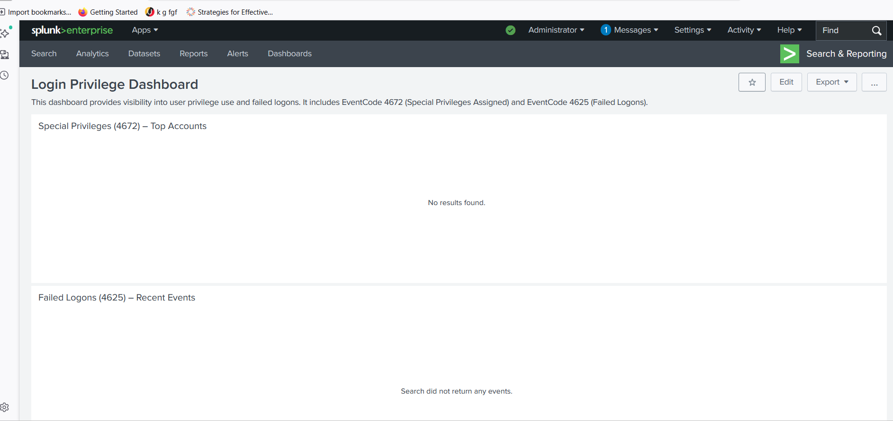

# SOC Dashboarding & Alert Triage – Authentication Monitoring (Splunk SIEM)



## Overview
SOC-focused Splunk detections and dashboards designed to monitor Windows authentication activity and privilege escalation signals.  
The project analyzes Windows Security Event Logs to identify failed logon patterns and high-privilege logons for triage and investigation.

## Why This Project Matters to SOC Teams
- Enables early detection of brute-force and credential misuse activity
- Highlights privileged logons that may indicate lateral movement or abuse
- Supports analyst triage using high-signal authentication telemetry

## Environment
- Platform: Splunk Enterprise / Splunk Free (lab)
- Data Sources: Windows Security Event Logs
- Index: `winlogs`
- Sourcetype: `WinEventLog:Security`
- Frameworks: SOC investigation workflows, MITRE ATT&CK (TA0006 Credential Access, TA0004 Privilege Escalation)

## Data Collected / Artifacts
- Event ID 4625 – Failed logon attempts
- Event ID 4672 – Special privileges assigned to logon
- Usernames, hostnames, logon types
- Timestamps and frequency patterns

## Detection Logic / Analysis Steps
1. Ingested Windows Security logs into Splunk
2. Created SPL queries filtering on Event IDs 4625 and 4672
3. Built dashboards to visualize failed logon volume and privilege assignment
4. Established baseline behavior for normal authentication patterns
5. Identified anomalies indicating potential misuse or escalation

## Findings / SOC Notes
- Failed logon spikes identified during authentication anomalies
- Privileged logons surfaced for analyst review
- Dashboard enables rapid pivoting by user and host
- Signals suitable for alerting with threshold tuning

## Outcome
- SOC-ready authentication monitoring dashboards validated
- Detections suitable for escalation or correlation with endpoint/network logs
- Recommended alert thresholds and ongoing tuning

## Evidence
- Splunk authentication dashboard (Event IDs 4625, 4672)
- SOC_Log_Analysis_Failed_Login_Assessment.pdf
- SPL detection queries for failed logons and privileged access

## Repository Structure
```text
/images        → dashboard screenshots  
/queries       → SPL detection queries  
README.md      → project documentation
---

## Author
**Niknaz Sadehvandi**  
**Cybersecurity Analyst**

